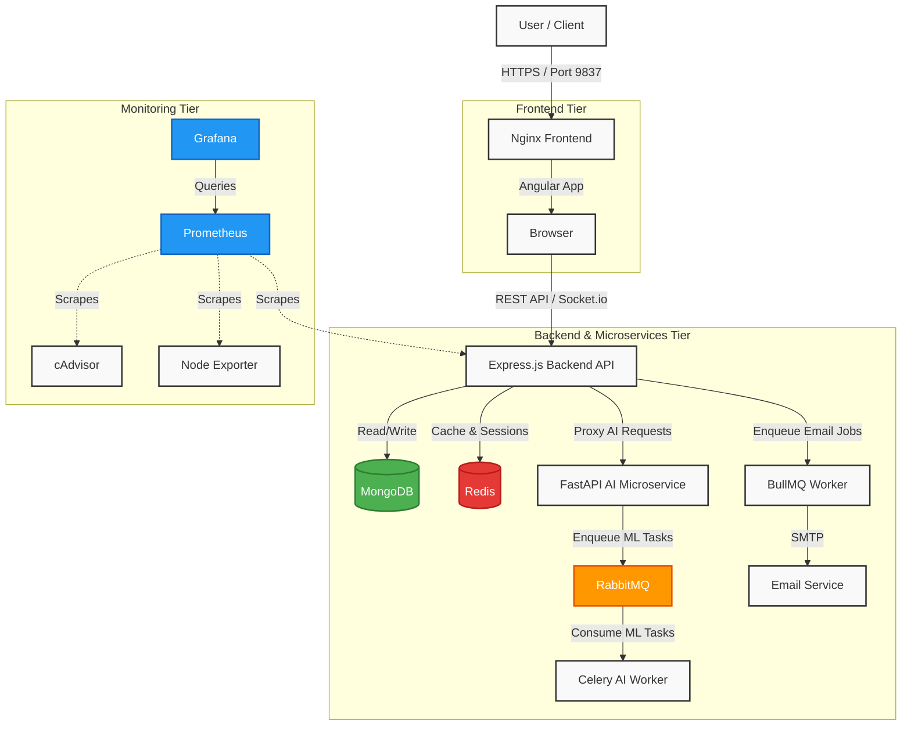

<div align="center">
  
  
  
  
  
  <h1>Lure E-Commerce 🚀</h1>
  
  <p><strong>A modern, microservices-based MERN e-commerce application featuring a world-class UI, interactive AI Chatbot, advanced analytics, and robust background task processing.</strong></p>
</div>

---

## 🌟 Advanced & Enterprise-Grade Features

We didn't just build an e-commerce platform; we engineered a highly scalable, intelligent, and premium shopping experience. Here is what makes this project stand out:

### 🎨 Next-Generation Frontend (Angular v21)
- **Ultra-Modern UI/UX:** Premium aesthetic featuring glassmorphism, dark mode, dynamic styling, and immersive 3D hover effects.
- **Immersive Visuals & UX:** Parallax hero sections, custom interactive cursors, tilt effects, and skeleton loading screens for flawless perceived performance.
- **High Performance:** Built with Angular Standalone Components, Signals, and lazy-loaded modules for blazing-fast page loads.
- **Progressive Web App (PWA):** Offline support, service workers, and Web Push notifications for native-like mobile experiences.
- **Real-Time Interactivity:** Seamless WebSocket (Socket.io) integration for live chat, instant notifications, and real-time order tracking.
- **Advanced Shopping Tools:** Dedicated Product Compare pages, beautifully integrated slide-out Cart & Checkout, and Wishlist management.

### 🧠 AI-Powered Microservice Engine
- **Dedicated Python Backend:** A separate FastAPI microservice utilizing state-of-the-art NLP Transformers for intelligent operations.
- **Asynchronous ML Processing:** Heavy machine learning tasks are offloaded using **Celery & RabbitMQ**, ensuring massive scalability.
- **Smart Chatbot:** A sleek, context-aware AI assistant floating UI to guide users and answer queries 24/7.
- **Intelligent Recommendations:** Smart product recommendations tailored to user behavior.

### ⚙️ Robust Backend Core
- **Scalable REST API:** Node.js & Express.js core handling massive throughput with optimized architecture.
- **Advanced E-Commerce Logic:** Product Variants, precise Stock/Inventory Management, Order Tracking, dynamic pricing, gift cards, and referral systems.
- **Enterprise Security:** Multi-layered defense with Security Headers (Helmet), Rate Limiting, CORS, JWT, and Google OAuth 2.0 (Social Login).
- **High-Speed Object Storage:** S3-compatible **MinIO** integration (via AWS SDK & Multer) for optimized, scalable, and self-hosted media uploads.
- **Distributed Caching & Queues:** Redis for ultra-fast query caching and BullMQ for reliable background jobs (automated emails, crons).
- **Seamless Payments:** Fully integrated, secure, and SCA-compliant Stripe payment gateway.

### 📊 Comprehensive Admin & Analytics
- **Powerful Admin Dashboard:** A beautifully crafted control panel to manage Products, Users, Orders, Coupons, and Reviews.
- **Data Visualization:** Real-time business intelligence and sales metrics powered by Chart.js.

### 🚀 DevOps & Observability
- **1-Click Containerization:** Entire ecosystem orchestrated seamlessly via Docker Compose (Dev & Prod environments) with advanced Healthchecks.
- **CI/CD & Automated Security:** Robust pipelines for automated testing, **CodeQL Security Scanning**, and continuous delivery.
- **Infrastructure Monitoring:** Out-of-the-box observability with **Prometheus**, **Grafana**, **Node Exporter**, and **cAdvisor**.
- **Proactive Error Tracking:** Integrated **Sentry** (Frontend & Node.js) for real-time bug tracking and performance monitoring.

## 🛠️ Tech Stack

### Frontend
- **Framework:** Angular v21, TypeScript
- **Styling:** SCSS, Modern Design Tokens, CSS Variables

### Backend
- **Core API:** Node.js, Express, Mongoose, JWT
- **Database:** MongoDB
- **AI Microservice:** Python, FastAPI, Celery
- **Message Broker & Caching:** RabbitMQ, Redis

### DevOps & Monitoring
- **Containerization:** Docker, Docker Compose
- **Web Server:** Nginx
- **Observability:** Prometheus, Grafana, Node Exporter, cAdvisor
- **Error Tracking:** Sentry

## 🏛️ System Architecture



## 🚀 Getting Started

The recommended way to run this highly-distributed architecture is via Docker Compose.

### Prerequisites
- [Docker](https://www.docker.com/) and [Docker Compose](https://docs.docker.com/compose/)

### Running with Docker

1. **Clone the repository:**
   ```bash
   git clone https://github.com/your-username/lure-ecommerce.git
   cd lure-ecommerce
   ```

2. **Configure Environment Variables:**
   Rename `.env.example` to `.env` in both the root, `backend/`, and `AI/` directories and populate them with your secrets (like Stripe API keys, MongoDB URLs, etc.).

3. **Spin up the Cluster:**
   ```bash
   docker compose up --build -d
   ```
   This command orchestrates:
   - `lure_mongodb`: Database
   - `lure_redis` & `lure_rabbitmq`: Message broker for Celery
   - `lure_backend`: Main Node.js API (Port `5000`)
   - `lure_ai` & `lure_celery_worker`: Python Microservices (Port `8000`)
   - `lure_frontend`: Nginx serving Angular (Port `9837`)
   - Monitoring Stack: Prometheus (`9090`), Grafana (`3000`), cAdvisor (`8080`), Node Exporter (`9100`)

4. **Access the Application:**
   - **Storefront:** [http://localhost:9837](http://localhost:9837)
   - **Grafana Dashboards:** [http://localhost:3000](http://localhost:3000) (Default Login: `admin`/`admin`)

## 🗄️ Project Structure

```text
├── AI/                 # Python FastAPI Microservice, Celery Tasks
├── backend/            # Express REST API, Models, Controllers
├── frontend/           # Angular Web App, SCSS Tokens, UI Components
├── monitoring/         # Prometheus & Grafana Provisioning configs
├── docker-compose.yml  # Microservices orchestration
└── README.md
```

## 🤝 Contributing

Contributions, issues, and feature requests are highly welcome! Feel free to check the issues page.

## 📝 License

This project is licensed under the MIT License.
